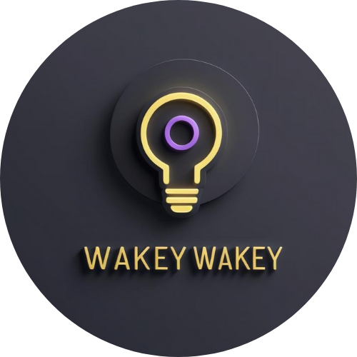

<div align="center">
  
  <h1>Wakey Wakey 💡</h1>
  <p><strong>A minimal browser app that keeps your screen awake — clean, distraction-free, and beautifully dark.</strong></p>

  <a href="https://wakey2x.vercel.app/" target="_blank">
    
  </a>

  <br><br>

  <p align="center"><strong>Tech Stack</strong></p>
  <p align="center">
    <a href="https://skillicons.dev">
      
    </a>
  </p>
</div>

---

## 🧠 Why I Built This

While working late-night shifts during my internship, I discovered that my laptop would frequently fall asleep — disconnecting my VPN and interrupting my workflow. Without the ability to modify system settings, I built **Wakey Wakey** as a lightweight, web-based alternative to keep my screen awake without hassle.

> _This app provides a clean and hassle-free solution for preventing your screen from locking or sleeping. Just toggle it on and let it run in the background — no installs, no extensions._

---

## ✨ Features

- 💡 Dim-lit lightbulb visual with toggle animation  
- 🔊 Toggle sound feedback  
- 🌘 Sleek dark mode interface  
- 🔁 Automatically reactivates on tab visibility change  
- 📱 PWA-ready and responsive across devices  
- ✅ No setup required — works instantly in modern browsers

---

## 🛠 How to Use

```bash
git clone https://github.com/YOUR_USERNAME/wakey-wakey.git
cd wakey-wakey
npx live-server
